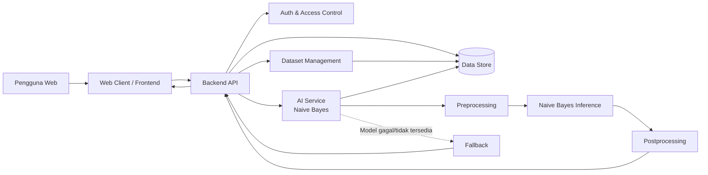
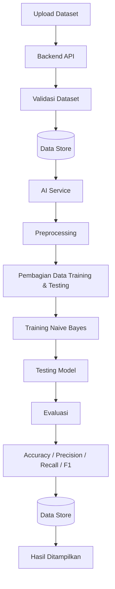
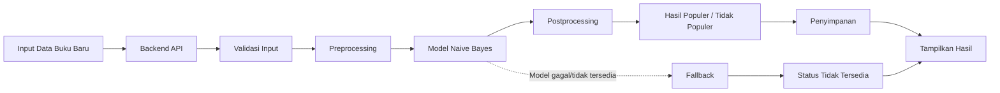

# DRAF HLD (High-Level Design)

## Sistem Informasi Buku Populer Berbasis Web

> **Status:** Draft

> **Platform:** Web

> **Fitur AI inti:** Naïve Bayes
---

## 1. Tujuan dan Ruang Lingkup HLD

HLD ini menjelaskan rancangan tingkat tinggi untuk Sistem Informasi Buku Populer Berbasis Web. Rancangan disusun berdasarkan PRD, SRS, dan user story/acceptance criteria.

Fokus arsitektur sistem meliputi:

1. Dashboard
2. Pengelolaan dataset
3. Upload dataset
4. Training model Naïve Bayes
5. Testing dan evaluasi model
6. Input data buku baru
7. Penentuan buku populer atau tidak populer
8. Penyimpanan dataset dan hasil proses

Detail class, method, query SQL, dan struktur kode tidak dibahas karena termasuk dalam LLD.

---

## 2. Diagram Arsitektur



### 2.1 Pola Arsitektur

Sistem menggunakan pola **client-server/layered architecture** yang memisahkan beberapa komponen utama:

1. **Web Client** — antarmuka yang digunakan pengguna.
2. **Backend API** — mengatur request, validasi, akses data, dan proses AI.
3. **AI Service** — menangani preprocessing, training, testing, evaluasi, dan inference Naïve Bayes.
4. **Data Store** — menyimpan dataset dan hasil proses sistem.
5. **Auth & Access Control** — mengatur akses terhadap fungsi sistem.

Tidak ada layanan eksternal yang diwajibkan oleh SRS.

---

## 3. Deskripsi Komponen

| Komponen              | Peran                | Tanggung Jawab                                                                                     | Teknologi Usulan             |
| --------------------- | -------------------- | -------------------------------------------------------------------------------------------------- | ---------------------------- |
| Web Client            | Antarmuka pengguna   | Menampilkan dashboard, upload dataset, hasil training/testing, input data baru, dan hasil prediksi | HTML, CSS, JavaScript        |
| Backend API           | Penghubung komponen  | Menerima request, melakukan validasi, mengatur data, dan memanggil AI Service                      | Python Flask                 |
| Auth & Access Control | Keamanan akses       | Membatasi akses terhadap fungsi tertentu                                                           | Session-based authentication |
| Dataset Management    | Pengelolaan dataset  | Upload, pengelolaan, dan penghapusan dataset                                                       | Backend API + Data Store     |
| AI Service            | Pemrosesan AI        | Preprocessing, training, testing, evaluasi, dan inference Naïve Bayes                              | Python + scikit-learn        |
| Data Store            | Penyimpanan          | Menyimpan dataset dan hasil proses                                                                 | MySQL                        |
| Fallback Handler      | Penanganan kegagalan | Mengembalikan status jika model tidak tersedia atau proses AI gagal                                | Backend API                  |

### 3.1 Keputusan Backend

**Rekomendasi: Python Flask.**

Flask dipilih karena ringan untuk prototype dan dapat terintegrasi dengan library machine learning Python. Hal ini sesuai dengan konstrain waktu satu semester.

**Alternatif:** FastAPI atau Django.

---

## 4. Keputusan Arsitektur AI

### 4.1 Perbandingan Implementasi AI

| Pilihan       | Akurasi              | Latensi            | Biaya               | Privasi                      | Effort |
| ------------- | -------------------- | ------------------ | ------------------- | ---------------------------- | ------ |
| Library lokal | Bergantung model     | Rendah             | Rendah              | Baik                         | Sedang |
| Cloud AI API  | Bergantung layanan   | Bergantung koneksi | Berpotensi berbayar | Data dikirim ke pihak ketiga | Sedang |
| On-device     | Bergantung perangkat | Dapat rendah       | Rendah              | Baik                         | Tinggi |

### 4.2 Keputusan

**Rekomendasi: menggunakan library AI secara lokal pada backend/server.**

Naïve Bayes dijalankan menggunakan library machine learning lokal. Pilihan ini sesuai dengan konstrain biaya minimal, mudah diintegrasikan dengan Python, dan tidak membutuhkan layanan AI eksternal.

**Alternatif:** cloud AI API, tetapi tidak menjadi pilihan utama karena terdapat konstrain biaya minimal.

---

## 5. Aliran Data End-to-End Fitur AI

### 5.1 Training dan Testing



Tahapan:

1. Pengguna mengunggah dataset.
2. Backend melakukan validasi.
3. Dataset disimpan.
4. AI Service mengambil dataset.
5. Data melalui preprocessing.
6. Data digunakan untuk training dan testing.
7. Model Naïve Bayes dilatih.
8. Model diuji.
9. Sistem menghitung accuracy, precision, recall, dan F1-score.
10. Hasil evaluasi disimpan dan ditampilkan.

Penelitian acuan menggunakan 1.000 data buku dan memperoleh hasil testing berupa accuracy **72,63%**, precision **71,84%**, recall **62,11%**, dan F1-score **62,34%**. Nilai tersebut menjadi baseline yang digunakan dalam SRS.

### 5.2 Alur Data Buku Baru



### 5.3 Preprocessing

Preprocessing dilakukan sebelum data diproses oleh model. Proses dapat mencakup:

1. pemeriksaan data;
2. penghapusan data duplikat;
3. normalisasi teks;
4. penghapusan simbol atau karakter yang tidak relevan;
5. stopword removal;
6. stemming.

### 5.4 Inference

Data yang telah melalui preprocessing diproses menggunakan model Naïve Bayes yang sudah dilatih.

Model menghasilkan hasil berupa:

* **Populer**
* **Tidak Populer**

### 5.5 Postprocessing

Hasil dari model diproses agar dapat ditampilkan dalam bentuk yang mudah dipahami pengguna.

### 5.6 Fallback

Jika model belum tersedia atau proses inference mengalami kegagalan, sistem tidak memberikan hasil yang dibuat-buat.

Sistem mengembalikan status **hasil tidak tersedia/gagal diproses**.

**[ASUMSI-01]** Bentuk pesan fallback secara detail belum ditentukan dalam SRS dan akan ditentukan pada LLD.

---

## 6. Kontrak Antarkomponen Tingkat Tinggi

### 6.1 API Utama

| API/Proses        | Tujuan                   | Input                | Output                          |
| ----------------- | ------------------------ | -------------------- | ------------------------------- |
| `POST /dataset`   | Upload dataset           | File dataset         | Status upload                   |
| `GET /dashboard`  | Mengambil data dashboard | Request pengguna     | Data dashboard                  |
| `POST /training`  | Menjalankan training     | Dataset              | Status training                 |
| `POST /testing`   | Menjalankan testing      | Model + data testing | Hasil evaluasi                  |
| `GET /evaluation` | Melihat evaluasi         | Request pengguna     | Accuracy, precision, recall, F1 |
| `POST /predict`   | Memproses data baru      | Data buku            | Hasil populer/tidak             |
| `DELETE /dataset` | Menghapus dataset        | Dataset              | Status penghapusan              |

> Detail parameter, validasi, HTTP status code, dan struktur API lengkap ditentukan pada LLD.

### 6.2 Format Data

#### Request Data Buku Baru

```json
{
  "title": "string",
  "price": "number",
  "review_helpfulness": "string",
  "review_summary": "string",
  "review_text": "string",
  "description": "string",
  "author": "string",
  "categories": "string"
}
```

#### Response Hasil AI

```json
{
  "status": "success",
  "result": "populer",
  "model": "naive_bayes"
}
```

#### Response Fallback

```json
{
  "status": "unavailable",
  "result": null,
  "message": "Hasil AI tidak tersedia."
}
```

**[ASUMSI-02]** Nama field API merupakan rancangan awal dan dapat disesuaikan pada tahap LLD.

---

## 7. Pemicu / Event

| Event               | Pemicu                        | Proses                                |
| ------------------- | ----------------------------- | ------------------------------------- |
| Dataset uploaded    | Pengguna upload dataset       | Validasi dan penyimpanan dataset      |
| Training requested  | Pengguna menjalankan training | Backend memanggil AI Service          |
| Testing requested   | Pengguna menjalankan testing  | AI Service melakukan testing          |
| New data submitted  | Pengguna memasukkan data baru | Backend meneruskan data ke AI Service |
| AI inference failed | Model gagal/tidak tersedia    | Backend menjalankan fallback          |
| Dataset deleted     | Pengguna menghapus dataset    | Backend menghapus dataset             |

---

## 8. Security & Privacy by Design

### 8.1 Authentication dan Access Control

Fungsi yang berkaitan dengan pengelolaan dataset dan proses sistem dibatasi menggunakan authentication dan access control.

**[ASUMSI-03]** Detail role pengguna belum ditentukan secara lengkap dalam SRS sehingga role matrix akan ditentukan pada LLD.

### 8.2 Enkripsi

1. Komunikasi client dan backend menggunakan HTTPS/TLS pada production.
2. Secret tidak disimpan langsung dalam source code.
3. Data tersimpan dilindungi oleh mekanisme keamanan server/database.

**[ASUMSI-04]** Detail enkripsi data-at-rest belum ditentukan dalam SRS.

### 8.3 Data Sensitif

Data hanya digunakan untuk kebutuhan sistem.

Karena AI dijalankan secara lokal, dataset tidak perlu dikirim ke layanan AI pihak ketiga.

### 8.4 Logging

Logging digunakan untuk membantu pemantauan dan penanganan error.

Informasi yang dapat dicatat:

1. waktu request;
2. status proses;
3. jenis proses;
4. error teknis.

Data sensitif tidak dicatat secara berlebihan.

**[ASUMSI-05]** Retensi dan format audit log belum ditentukan dalam SRS.

---

## 9. Pemetaan NFR ke Arsitektur

| NFR    | Kebutuhan                 | Respons Arsitektur                           |
| ------ | ------------------------- | -------------------------------------------- |
| NFR-01 | Latensi AI ≤ 5 detik/data | AI Service lokal                             |
| NFR-02 | Accuracy ≥ 72,63%         | Evaluasi model                               |
| NFR-03 | Precision ≥ 71,84%        | Evaluasi precision                           |
| NFR-04 | Recall ≥ 62,11%           | Evaluasi recall                              |
| NFR-05 | F1-score ≥ 62,34%         | Evaluasi F1-score                            |
| NFR-06 | Security                  | Authentication, access control, HTTPS/TLS    |
| NFR-07 | Privacy                   | AI lokal dan pembatasan penggunaan data      |
| NFR-08 | Usability                 | Web client dengan alur fitur utama sederhana |
| NFR-09 | Reliability               | Model digunakan secara konsisten             |
| NFR-10 | Processing success ≥ 95%  | Validasi input dan error handling            |
| NFR-11 | Fallback AI               | Status tidak tersedia ketika model gagal     |

---

## 10. Penyimpanan Data Tingkat Tinggi

Data Store menangani beberapa kelompok data:

1. **Dataset Buku**

   * data buku;
   * atribut buku;
   * label popularitas untuk data training.

2. **Informasi Model**

   * status model;
   * model yang tersedia untuk inference.

3. **Hasil Evaluasi**

   * accuracy;
   * precision;
   * recall;
   * F1-score.

4. **Hasil Pengujian Data Baru**

   * data input yang diperlukan;
   * hasil populer/tidak populer;
   * status proses.

**[ASUMSI-06]** Struktur tabel, primary key, foreign key, dan relasi detail ditentukan pada LLD.

---

## 11. Lingkungan Deployment

### 11.1 Development

```text
Browser
   ↓
Flask Backend
   ↓
AI Service Lokal
   ↓
MySQL
```

Digunakan untuk pengembangan dan pengujian awal.

### 11.2 Staging

```text
Browser
   ↓
Backend
   ↓
AI Service
   ↓
Database
```

Digunakan untuk pengujian sebelum deployment production.

### 11.3 Production

```text
Web Browser
     ↓ HTTPS
Web Server / Backend
     ↓
AI Service Lokal
     ↓
Database
```

**[ASUMSI-07]** Provider hosting, domain, dan spesifikasi server belum ditentukan dalam SRS.

---

## 12. Keputusan Arsitektur Utama

| Keputusan                        | Alasan                                                            | Alternatif                      |
| -------------------------------- | ----------------------------------------------------------------- | ------------------------------- |
| Client-server/layered            | Memisahkan frontend, backend, AI, dan data                        | Arsitektur monolithic sederhana |
| AI library lokal                 | Biaya rendah, integrasi mudah, data tidak dikirim ke pihak ketiga | Cloud AI API                    |
| Flask                            | Ringan dan sesuai prototype                                       | FastAPI / Django                |
| MySQL                            | Sesuai untuk data terstruktur                                     | PostgreSQL                      |
| AI Service terpisah secara logis | Memisahkan proses AI dari request handling                        | AI langsung pada route backend  |
| Fallback status tidak tersedia   | Mencegah sistem memberikan hasil AI yang tidak valid              | Menggunakan hasil terakhir      |

---

## 13. Traceability HLD terhadap Kebutuhan

| Kebutuhan                    | Komponen/Aliran                               |
| ---------------------------- | --------------------------------------------- |
| Dashboard                    | Web Client + Backend API + Data Store         |
| Upload Dataset               | Web Client + Backend API + Dataset Management |
| Manajemen Dataset            | Backend API + Data Store                      |
| Training Naïve Bayes         | Backend API + AI Service                      |
| Testing Model                | AI Service                                    |
| Accuracy/Precision/Recall/F1 | AI Service + Evaluation                       |
| Input Data Baru              | Web Client + Backend API                      |
| Hasil Populer/Tidak Populer  | AI Service                                    |
| Menampilkan Hasil            | Backend API + Web Client                      |
| Security                     | Auth + Backend                                |
| Privacy                      | AI lokal + Data Store                         |
| Performa                     | AI Service lokal                              |
| Fallback                     | AI Service + Backend API                      |

---

## 14. Batasan HLD

HLD ini tidak membahas:

1. class dan object;
2. method/function detail;
3. query SQL;
4. struktur tabel secara rinci;
5. pseudocode algoritma;
6. detail implementasi kode;
7. konfigurasi server secara mendalam.

Hal tersebut akan dibahas pada **LLD awal**.

---

## 15. Checklist Review HLD

* [x] Semua kebutuhan penting SRS terwakili.
* [x] Komponen utama sudah ditentukan.
* [x] Alur AI end-to-end sudah lengkap.
* [x] Fallback ketika model gagal/tidak tersedia sudah ditentukan.
* [x] Keputusan AI lokal vs cloud/on-device sudah dibandingkan.
* [x] Performa dan akurasi sudah dihubungkan dengan arsitektur.
* [x] Security dan privacy sudah ditempatkan.
* [x] Kontrak API tingkat tinggi sudah tersedia.
* [x] Deployment development/staging/production sudah dijelaskan.
* [x] Gap diberi `[ASUMSI-XX]`.
* [x] Tidak terdapat detail class, method, maupun SQL.

---

## 16. Ringkasan Arsitektur

Sistem menggunakan arsitektur **Web Client → Backend API → AI Service → Data Store**. Web Client digunakan sebagai antarmuka pengguna, Backend API menjadi penghubung antarkomponen, AI Service menjalankan proses Naïve Bayes, sedangkan Data Store menyimpan dataset dan hasil proses.

Naïve Bayes ditempatkan sebagai **library lokal pada server** karena sesuai dengan konstrain prototype satu semester dan biaya minimal. Pendekatan ini juga mengurangi ketergantungan terhadap layanan AI eksternal.

HLD ini selanjutnya menjadi dasar untuk penyusunan **LLD awal**, terutama untuk memperinci modul, struktur data, kontrak API, dan error handling.
