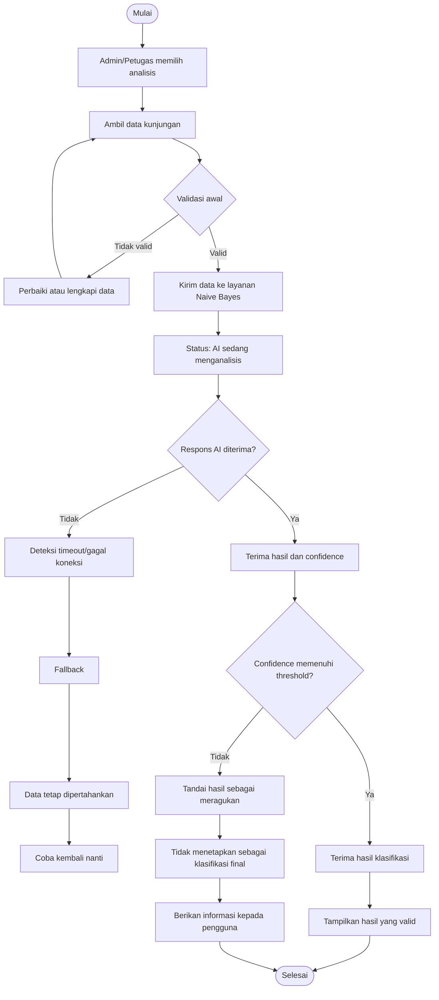

# USER FLOW

## Praktikum Prompt AI · Intelligent Mobile and Web Application Development

**Program Studi:** Teknik Informatika
**Tahapan:** PRD → SRS → HLD → LLD
**Proyek:** Sistem Informasi Buku Tamu Digital
**Platform:** Website
**Fitur AI:** Naïve Bayes

---

# 1. Tujuan User Flow

User Flow ini menggambarkan alur interaksi pengguna pada dua fitur utama:

1. **Pencatatan Data Kunjungan**
2. **Analisis Data Kunjungan menggunakan Naïve Bayes ★**

Alur dirancang agar pengguna mengetahui status proses yang sedang berlangsung dan tetap memiliki jalur alternatif apabila layanan AI mengalami kegagalan.

---

# 2. Fitur 1 — Pencatatan Data Kunjungan

## 2.1 Aktor

**Aktor:** Tamu

## 2.2 Tujuan

Tamu dapat mencatat data kunjungan secara digital sehingga data dapat tersimpan dan digunakan untuk pengelolaan serta analisis.

## 2.3 User Flow

```text
Mulai
  ↓
Tamu mengakses sistem
  ↓
Tamu memulai pencatatan kunjungan
  ↓
Tamu mengisi data kunjungan
  ↓
Sistem melakukan validasi awal
  ↓
┌─────────────────────────┐
│ Data valid dan lengkap? │
└───────────┬─────────────┘
        Ya  │  Tidak
            │
            ↓
      Data diperbaiki
            │
            └──────→ Validasi ulang
                    ↓
              Data valid
                    ↓
             Data dikirim
                    ↓
          Sistem menyimpan data
                    ↓
        Penyimpanan berhasil?
             /          \
           Ya            Tidak
           ↓               ↓
    Data tercatat     Proses gagal
           ↓               ↓
         Selesai       Coba kembali
```

## 2.4 Langkah Terstruktur

1. Tamu mengakses sistem.
2. Tamu memulai proses pencatatan kunjungan.
3. Tamu mengisi data yang diperlukan.
4. Sistem melakukan validasi awal terhadap data.
5. Jika data tidak lengkap atau tidak valid, sistem meminta data diperbaiki.
6. Tamu memperbaiki data.
7. Sistem melakukan validasi ulang.
8. Jika data valid, sistem memproses penyimpanan.
9. Data kunjungan disimpan.
10. Sistem memberikan status bahwa pencatatan berhasil.
11. Proses selesai.

## 2.5 Jalur Gagal

Jika penyimpanan gagal:

1. Sistem tidak menganggap data sebagai berhasil tersimpan.
2. Sistem memberikan informasi bahwa proses belum berhasil.
3. Data tetap dapat diperbaiki atau dikirim kembali.
4. Tamu dapat mencoba proses penyimpanan kembali.

---

# 3. Fitur 2 — Analisis Data Kunjungan dengan Naïve Bayes ★

## 3.1 Aktor

**Aktor utama:** Admin/Petugas

**Aktor pendukung:** Layanan Inferensi Naïve Bayes dan Database

## 3.2 Tujuan

Admin/Petugas memperoleh hasil klasifikasi berdasarkan data kunjungan yang tersedia tanpa menganggap bahwa layanan AI selalu berhasil atau selalu menghasilkan prediksi dengan tingkat keyakinan tinggi.

---

# 4. User Flow Fitur AI ★

```text
┌──────────────┐
│    MULAI     │
└──────┬───────┘
       ↓
Admin/Petugas mengakses data kunjungan
       ↓
Memilih proses analisis
       ↓
┌──────────────────────────────┐
│ STATUS 1                     │
│ Validasi awal                │
│ Data diperiksa sebelum       │
│ dikirim ke layanan AI        │
└──────────────┬───────────────┘
               ↓
       Data memenuhi syarat?
          /             \
       Tidak             Ya
        ↓                 ↓
 Data diperbaiki      Data dikirim
 atau analisis             ↓
 dihentikan         ┌─────────────────┐
                     │ STATUS 2        │
                     │ AI memproses    │
                     │ Data            │
                     └────────┬────────┘
                              ↓
                    AI memberikan respons?
                       /             \
                    Tidak             Ya
                     ↓                 ↓
              ┌──────────────┐   Hasil + confidence
              │ FALLBACK     │          ↓
              │ AI gagal     │   ┌──────────────────┐
              └──────┬───────┘   │ STATUS 3         │
                     ↓            │ Evaluasi hasil   │
              Simpan data         └────────┬─────────┘
              tetap aman                   ↓
                     ↓              Confidence cukup?
              Coba analisis            /          \
              kembali nanti          Ya            Tidak
                                      ↓               ↓
                              Hasil diterima    Hasil meragukan
                                      ↓               ↓
                              ┌──────────────────────────┐
                              │ STATUS 4                 │
                              │ Hasil ditampilkan /      │
                              │ tidak ditetapkan sebagai │
                              │ klasifikasi final        │
                              └────────────┬─────────────┘
                                           ↓
                                         Selesai
```

---

# 5. Empat Status Sistem

## Status 1 — Validasi Awal

**Tujuan:** Memastikan data layak diproses sebelum dikirim ke layanan AI.

Alur:

1. Admin/Petugas memulai analisis.
2. Sistem mengambil data yang diperlukan.
3. Sistem memeriksa kelengkapan dan kualitas data.
4. Sistem menentukan apakah data memenuhi persyaratan.
5. Data yang tidak memenuhi persyaratan tidak dikirim ke layanan AI.

**Jika valid:** proses dilanjutkan ke inferensi.

**Jika tidak valid:** pengguna diberi informasi bahwa data perlu diperbaiki atau dilengkapi.

---

## Status 2 — AI Sedang Menganalisis

**Tujuan:** Memberikan informasi bahwa proses inferensi sedang berlangsung.

Alur:

1. Sistem mengirim data yang telah divalidasi ke layanan inferensi Naïve Bayes.
2. Sistem masuk ke status pemrosesan.
3. Sistem memberikan indikator bahwa analisis sedang berlangsung.
4. Sistem menunggu respons sampai batas waktu yang ditentukan oleh NFR.
5. Sistem menerima respons atau mendeteksi kegagalan.

**Prinsip UX:**
Pengguna tidak dibiarkan tanpa informasi ketika proses AI berlangsung.

---

## Status 3 — Penanganan Hasil

Setelah layanan AI memberikan hasil, sistem memeriksa hasil klasifikasi dan skor keyakinan.

### A. Confidence Memenuhi Ambang Batas

```text
Hasil AI
   ↓
Periksa confidence
   ↓
Confidence ≥ threshold
   ↓
Hasil diterima
   ↓
Hasil klasifikasi tersedia
   ↓
Selesai
```

Hasil dapat digunakan sebagai hasil klasifikasi sesuai aturan bisnis dan NFR yang ditentukan pada SRS.

### B. Confidence Di Bawah Ambang Batas

```text
Hasil AI
   ↓
Periksa confidence
   ↓
Confidence < threshold
   ↓
Hasil ditandai meragukan
   ↓
Tidak digunakan sebagai klasifikasi final
   ↓
Pengguna mendapat informasi
   ↓
Dapat dilakukan analisis ulang
```

Hasil dengan **low confidence** tidak diperlakukan sebagai klasifikasi final.

---

# 6. Status 4 — Fallback AI

Fallback digunakan ketika layanan AI tidak memberikan hasil yang dapat digunakan.

## Kondisi Fallback

* Koneksi ke layanan AI gagal.
* Permintaan mengalami timeout.
* Layanan AI tidak memberikan respons.
* Hasil AI tidak memenuhi kondisi validitas.

## Alur Fallback

```text
AI dipanggil
    ↓
Tidak ada respons
    ↓
Sistem mendeteksi timeout / gagal koneksi
    ↓
Proses inferensi ditandai gagal
    ↓
Data kunjungan tetap dipertahankan
    ↓
Tidak membuat hasil klasifikasi palsu
    ↓
Pengguna diberi informasi
    ↓
┌────────────────────────────┐
│ Pilihan proses berikutnya  │
├────────────────────────────┤
│ Coba analisis kembali      │
│ atau lanjut tanpa AI       │
└────────────────────────────┘
```

Fallback memastikan kegagalan layanan AI tidak menyebabkan kehilangan data kunjungan.

---

# 7. Diagram Mermaid



---

# 8. Kaitan User Flow dengan Use Case

| Bagian User Flow                 | Use Case                                               | User Story | FR    |
| -------------------------------- | ------------------------------------------------------ | ---------- | ----- |
| Pencatatan data                  | UC-01 Mencatat Data Kunjungan                          | US-01      | FR-01 |
| Validasi data kunjungan          | UC-01                                                  | US-01      | FR-01 |
| Penyimpanan data                 | UC-01                                                  | US-01      | FR-01 |
| Memulai analisis                 | UC-03 Menganalisis Data Kunjungan dengan Naïve Bayes ★ | US-05 ★    | FR-05 |
| Validasi awal data AI            | UC-03                                                  | US-05 ★    | FR-05 |
| Pemrosesan Naïve Bayes           | UC-03                                                  | US-05 ★    | FR-05 |
| Pemeriksaan confidence           | UC-03                                                  | US-05 ★    | FR-05 |
| Penanganan low confidence        | UC-03                                                  | US-05 ★    | FR-05 |
| Penanganan timeout/gagal koneksi | UC-03                                                  | US-05 ★    | FR-05 |
| Menampilkan hasil klasifikasi    | UC-04 Melihat Hasil Klasifikasi Kunjungan ★            | US-06 ★    | FR-06 |

---

# 9. Hubungan dengan NFR Respon Waktu

| Kondisi                          | Respons Sistem                                                           |
| -------------------------------- | ------------------------------------------------------------------------ |
| Data sedang divalidasi           | Sistem melakukan pemeriksaan sebelum pengiriman ke AI.                   |
| AI sedang memproses              | Sistem memberikan status bahwa analisis sedang berlangsung.              |
| Respons AI masih dalam batas NFR | Sistem menunggu dan menerima hasil inferensi.                            |
| Respons melewati batas NFR       | Sistem menganggap permintaan mengalami timeout dan menjalankan fallback. |
| AI mengembalikan low confidence  | Sistem tidak menetapkan hasil sebagai klasifikasi final.                 |
| AI gagal terhubung               | Sistem mempertahankan data dan memberikan opsi untuk mencoba kembali.    |

> Nilai numerik batas waktu harus mengikuti NFR yang telah ditetapkan pada `srs.md` dan tidak ditentukan ulang dalam User Flow.

---

# 10. Prinsip UX yang Digunakan

1. **Transparansi proses** — pengguna diberi informasi ketika sistem sedang memproses analisis AI.
2. **Validasi sebelum inferensi** — data diperiksa sebelum dikirim ke layanan AI.
3. **Tidak menganggap AI selalu benar** — hasil diperiksa berdasarkan skor keyakinan.
4. **Fallback tersedia** — pengguna memiliki jalur ketika AI gagal merespons.
5. **Data tetap aman** — kegagalan layanan AI tidak menghapus data kunjungan.
6. **Tidak ada hasil palsu** — sistem tidak membuat atau menetapkan klasifikasi ketika layanan AI gagal.
7. **Pengguna tetap memiliki kontrol** — proses dapat dicoba kembali ketika layanan AI tersedia.

---

# 11. Checklist Review Tahap 3

* [x] Terdapat validasi awal sebelum data dikirim ke AI.
* [x] Terdapat status visual/logis ketika AI sedang memproses data.
* [x] Terdapat penanganan untuk hasil dengan confidence yang cukup.
* [x] Terdapat penanganan untuk hasil low confidence.
* [x] Terdapat fallback ketika AI timeout atau gagal koneksi.
* [x] Data pengguna tetap dipertahankan ketika AI gagal.
* [x] Pengguna memiliki jalan keluar atau pilihan untuk mencoba kembali.
* [x] Alur dimulai dari titik masuk hingga proses selesai.
* [x] Alur tidak bergantung pada asumsi bahwa AI selalu berhasil.
* [x] Tidak membahas detail coding atau implementasi UI.
* [ ] Nilai batas waktu harus dicocokkan dengan NFR pada `srs.md`.
