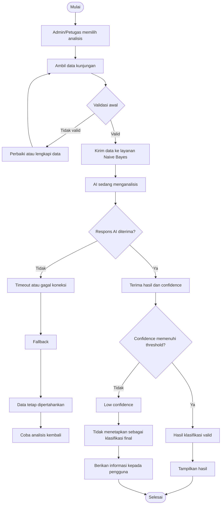

# USER STORIES

## Praktikum Prompt AI · Intelligent Mobile and Web Application Development

**Program Studi:** Teknik Informatika
**Tahapan:** PRD → SRS → HLD → LLD
**Proyek:** Sistem Informasi Buku Tamu Digital
**Platform:** Website
**Metode AI:** Naïve Bayes

---

# 1. User Stories

User Stories berikut diturunkan dari Functional Requirements (FR) pada SRS dan menggunakan persona yang telah ditentukan pada PRD.

| ID Story | Narasi                                                                                                                                                                                                             | FR Asal | Prioritas   | Kategori   |
| -------- | ------------------------------------------------------------------------------------------------------------------------------------------------------------------------------------------------------------------ | ------- | ----------- | ---------- |
| US-01    | Sebagai **tamu**, saya ingin mengisi data kunjungan secara digital, agar proses pencatatan kunjungan dapat dilakukan tanpa pencatatan manual.                                                                      | FR-01   | Must Have   | Fitur Inti |
| US-02    | Sebagai **admin/petugas**, saya ingin melihat data kunjungan yang telah dicatat, agar saya dapat mengetahui dan memantau riwayat kunjungan tamu.                                                                   | FR-02   | Must Have   | Fitur Inti |
| US-03    | Sebagai **admin/petugas**, saya ingin mengelola data kunjungan, agar data yang tersimpan tetap dapat dikelola sesuai kebutuhan administrasi.                                                                       | FR-03   | Must Have   | Fitur Inti |
| US-04    | Sebagai **admin/petugas**, saya ingin melihat ringkasan data kunjungan melalui dashboard, agar pola dan informasi kunjungan dapat dipantau dengan lebih terstruktur.                                               | FR-04   | Must Have   | Fitur Inti |
| US-05 ★  | Sebagai **admin/petugas**, saya ingin mendapatkan hasil klasifikasi menggunakan Naïve Bayes berdasarkan data kunjungan, agar saya dapat memperoleh informasi pola atau kategori kunjungan dari data yang tersedia. | FR-05   | Must Have   | Fitur AI ★ |
| US-06 ★  | Sebagai **admin/petugas**, saya ingin melihat hasil klasifikasi Naïve Bayes pada dashboard, agar informasi hasil analisis dapat digunakan untuk memahami data kunjungan.                                           | FR-06   | Should Have | Fitur AI ★ |

---

# 2. Evaluasi INVEST

| ID      | Independent | Negotiable | Valuable | Estimable | Small | Testable | Evaluasi                                                                   |
| ------- | ----------- | ---------- | -------- | --------- | ----- | -------- | -------------------------------------------------------------------------- |
| US-01   | ✓           | ✓          | ✓        | ✓         | ✓     | ✓        | Story dapat diuji melalui proses pencatatan data kunjungan.                |
| US-02   | ✓           | ✓          | ✓        | ✓         | ✓     | ✓        | Story memiliki tujuan dan hasil yang dapat diverifikasi.                   |
| US-03   | ✓           | ✓          | ✓        | ✓         | ✓     | ✓        | Pengelolaan data memiliki ruang lingkup yang jelas.                        |
| US-04   | ✓           | ✓          | ✓        | ✓         | ✓     | ✓        | Ringkasan data dapat diverifikasi berdasarkan data kunjungan.              |
| US-05 ★ | ✓           | ✓          | ✓        | ✓         | ✓     | ✓        | Fitur AI terpisah dari CRUD dan dapat diuji berdasarkan hasil klasifikasi. |
| US-06 ★ | ✓           | ✓          | ✓        | ✓         | ✓     | ✓        | Penyajian hasil AI dipisahkan dari proses inferensi.                       |

---

# 3. Use Case

## 3.1 Daftar Use Case

| ID    | Nama Use Case                                    | Aktor Utama   | Aktor Pendukung                         | Prioritas   |
| ----- | ------------------------------------------------ | ------------- | --------------------------------------- | ----------- |
| UC-01 | Mencatat Data Kunjungan                          | Tamu          | Database                                | Must Have   |
| UC-02 | Mengelola Data Kunjungan                         | Admin/Petugas | Database                                | Must Have   |
| UC-03 | Menganalisis Data Kunjungan dengan Naïve Bayes ★ | Admin/Petugas | Layanan Inferensi Naïve Bayes, Database | Must Have   |
| UC-04 | Melihat Hasil Klasifikasi Kunjungan ★            | Admin/Petugas | Layanan Inferensi Naïve Bayes, Database | Should Have |

---

## 3.2 UC-01 — Mencatat Data Kunjungan

**Aktor Utama:** Tamu
**Aktor Pendukung:** Database
**User Story:** US-01
**FR:** FR-01

### Precondition

* Sistem dapat diakses.
* Tamu dapat melakukan pencatatan kunjungan.
* Database tersedia.

### Postcondition

Data kunjungan berhasil tersimpan dan tersedia untuk pengelolaan serta analisis.

### Alur Utama

1. Tamu memulai pencatatan kunjungan.
2. Sistem meminta data kunjungan.
3. Tamu mengisi data.
4. Sistem melakukan validasi data.
5. Sistem menyimpan data yang valid ke database.
6. Sistem memberikan status pencatatan berhasil.
7. Proses selesai.

### Alur Alternatif

**A1 — Data tidak lengkap**

1. Sistem menemukan data belum lengkap.
2. Sistem meminta tamu melengkapi data.
3. Tamu melengkapi data.
4. Sistem melakukan validasi ulang.
5. Proses dilanjutkan ke penyimpanan.

### Eksepsi

**E1 — Database tidak tersedia**

1. Sistem gagal menyimpan data.
2. Sistem tidak menganggap pencatatan berhasil.
3. Sistem memberikan informasi bahwa proses gagal.
4. Tamu dapat mencoba kembali.

---

# 4. UC-02 — Mengelola Data Kunjungan

**Aktor Utama:** Admin/Petugas
**Aktor Pendukung:** Database
**User Story:** US-02, US-03
**FR:** FR-02, FR-03

### Precondition

* Data kunjungan tersedia.
* Admin/Petugas dapat mengakses data.
* Database tersedia.

### Postcondition

Data kunjungan berhasil ditampilkan atau dikelola.

### Alur Utama

1. Admin/Petugas memulai pengelolaan data.
2. Sistem mengambil data dari database.
3. Sistem menyediakan data kunjungan.
4. Admin/Petugas memilih data yang akan dikelola.
5. Sistem memproses tindakan yang dilakukan.
6. Sistem menyimpan perubahan.
7. Sistem menyediakan data terbaru.

### Alur Alternatif

**A1 — Data tidak ditemukan**

1. Admin/Petugas meminta data tertentu.
2. Sistem mencari data pada database.
3. Data tidak ditemukan.
4. Sistem memberikan informasi bahwa data tidak tersedia.
5. Admin/Petugas dapat melakukan pencarian kembali.

### Eksepsi

**E1 — Database gagal diakses**

1. Sistem gagal mengambil atau menyimpan data.
2. Sistem menghentikan proses.
3. Sistem memberikan informasi kegagalan.
4. Data yang belum berhasil disimpan tidak dianggap sebagai perubahan berhasil.

---

# 5. UC-03 — Menganalisis Data Kunjungan dengan Naïve Bayes ★

**Aktor Utama:** Admin/Petugas
**Aktor Pendukung:** Layanan Inferensi Naïve Bayes, Database
**User Story:** US-05 ★
**FR:** FR-05

### Tujuan

Menghasilkan klasifikasi berdasarkan data kunjungan menggunakan metode Naïve Bayes.

### Precondition

* Data kunjungan tersedia.
* Variabel dan kelas klasifikasi telah ditentukan.
* Data memenuhi persyaratan analisis.
* Layanan inferensi tersedia.

### Postcondition

Hasil klasifikasi dan skor confidence tersedia apabila proses inferensi berhasil.

### Alur Utama

1. Admin/Petugas memulai analisis.
2. Sistem mengambil data kunjungan.
3. Sistem memeriksa kelengkapan dan kualitas data.
4. Sistem menyiapkan data untuk analisis.
5. Sistem mengirim data ke layanan Naïve Bayes.
6. Layanan AI melakukan inferensi.
7. Layanan AI mengembalikan hasil klasifikasi dan skor confidence.
8. Sistem memeriksa skor confidence.
9. Jika confidence memenuhi ambang batas, sistem menerima hasil.
10. Sistem menyimpan atau meneruskan hasil untuk ditampilkan.
11. Proses selesai.

### Alur Alternatif

**A1 — Data tidak memadai**

1. Sistem memeriksa data.
2. Data belum memenuhi persyaratan analisis.
3. Sistem tidak melakukan inferensi.
4. Sistem memberikan informasi bahwa data belum dapat dianalisis.

### Eksepsi AI

**E-AI-01 — Kualitas input rendah**

1. Sistem menemukan data tidak memenuhi persyaratan.
2. Sistem menghentikan pengiriman data ke AI.
3. Sistem memberikan informasi bahwa data perlu diperbaiki.
4. Tidak ada klasifikasi yang dihasilkan.

**E-AI-02 — Timeout atau gagal koneksi**

1. Sistem mengirim permintaan inferensi.
2. Layanan AI tidak memberikan respons dalam batas waktu yang ditentukan.
3. Sistem menandai inferensi sebagai gagal.
4. Sistem tidak menetapkan hasil klasifikasi baru.
5. Data kunjungan tetap dipertahankan.
6. Pengguna dapat mencoba analisis kembali.

**E-AI-03 — Low Confidence**

1. Sistem menerima hasil dan confidence.
2. Sistem membandingkan confidence dengan ambang batas.
3. Confidence berada di bawah ambang batas.
4. Sistem menandai hasil sebagai meragukan.
5. Sistem tidak menetapkan hasil sebagai klasifikasi final.

---

# 6. UC-04 — Melihat Hasil Klasifikasi Kunjungan ★

**Aktor Utama:** Admin/Petugas
**Aktor Pendukung:** Database, Layanan Inferensi Naïve Bayes
**User Story:** US-06 ★
**FR:** FR-06

### Precondition

* Data kunjungan tersedia.
* Hasil klasifikasi tersedia.
* Hasil memiliki status valid.

### Postcondition

Admin/Petugas memperoleh hasil klasifikasi yang valid.

### Alur Utama

1. Admin/Petugas meminta hasil analisis.
2. Sistem mengambil hasil klasifikasi.
3. Sistem memeriksa status hasil.
4. Sistem memastikan hasil memenuhi kondisi validitas.
5. Sistem menyediakan hasil klasifikasi.
6. Proses selesai.

### Alur Alternatif

**A1 — Belum ada hasil**

1. Admin/Petugas meminta hasil analisis.
2. Sistem tidak menemukan hasil klasifikasi.
3. Sistem memberikan informasi bahwa analisis belum tersedia.
4. Admin/Petugas dapat menjalankan proses analisis.

### Eksepsi AI

**E-AI-01 — Hasil low confidence**

1. Sistem menemukan confidence di bawah ambang batas.
2. Sistem tidak menetapkan hasil sebagai klasifikasi final.
3. Sistem memberikan informasi bahwa hasil meragukan.

**E-AI-02 — AI tidak tersedia**

1. Sistem mencoba menjalankan analisis baru.
2. Layanan AI mengalami timeout atau gagal koneksi.
3. Sistem tidak menghasilkan klasifikasi baru.
4. Data kunjungan tetap tersedia.
5. Pengguna dapat mencoba kembali.

---

# 7. User Flow

## 7.1 Flow Pencatatan Data Kunjungan

```text
Mulai
  ↓
Tamu mengakses sistem
  ↓
Memulai pencatatan kunjungan
  ↓
Mengisi data kunjungan
  ↓
Validasi data
  ↓
Data valid?
 ┌──────────────┴──────────────┐
Tidak                         Ya
 ↓                             ↓
Perbaiki data             Simpan data
 ↓                             ↓
Validasi ulang           Penyimpanan berhasil?
                               ↓
                         ┌─────┴─────┐
                        Tidak        Ya
                         ↓            ↓
                    Coba kembali   Berhasil
                                      ↓
                                    Selesai
```

---

## 7.2 Flow Analisis Naïve Bayes ★

```text
Mulai
  ↓
Admin/Petugas memilih analisis
  ↓
Sistem mengambil data kunjungan
  ↓
Validasi awal
  ↓
Data memenuhi syarat?
 ┌──────────────┴──────────────┐
Tidak                         Ya
 ↓                             ↓
Perbaiki/lengkapi         Kirim ke AI
data                            ↓
                         AI sedang memproses
                               ↓
                       Respons AI diterima?
                       ┌────────┴────────┐
                      Tidak             Ya
                       ↓                 ↓
                  Fallback       Hasil + confidence
                       ↓                 ↓
                 Data tetap        Confidence
                 dipertahankan     memenuhi threshold?
                                     ┌────┴────┐
                                    Ya        Tidak
                                     ↓          ↓
                              Hasil valid   Low confidence
                                     ↓          ↓
                              Tampilkan     Tidak menjadi
                              hasil         klasifikasi final
                                     ↓          ↓
                                  Selesai    Selesai
```

---

# 8. Empat Status Sistem AI

## Status 1 — Validasi Awal

Sistem memeriksa data sebelum dikirim ke layanan AI.

* Memeriksa kelengkapan data.
* Memeriksa kualitas data.
* Data yang tidak memenuhi persyaratan tidak dikirim ke AI.
* Pengguna diberi informasi apabila data perlu diperbaiki.

## Status 2 — AI Sedang Menganalisis

Setelah data valid:

1. Sistem mengirim data ke layanan inferensi.
2. Sistem menunjukkan bahwa analisis sedang berlangsung.
3. Sistem menunggu respons sesuai batas waktu NFR.
4. Sistem menerima respons atau mendeteksi kegagalan.

## Status 3 — Penanganan Hasil

### Confidence memenuhi threshold

```text
Hasil AI
   ↓
Confidence memenuhi threshold
   ↓
Hasil diterima
   ↓
Klasifikasi valid
```

### Confidence rendah

```text
Hasil AI
   ↓
Confidence < threshold
   ↓
Hasil ditandai meragukan
   ↓
Tidak digunakan sebagai klasifikasi final
```

## Status 4 — Fallback

Jika AI timeout atau gagal koneksi:

```text
AI gagal
  ↓
Inferensi ditandai gagal
  ↓
Tidak membuat hasil klasifikasi baru
  ↓
Data tetap dipertahankan
  ↓
Pengguna dapat mencoba kembali
```

---

# 9. Diagram User Flow AI



---

# 10. Acceptance Criteria

## 10.1 US-01 — Mencatat Data Kunjungan

### Scenario 1 — Data berhasil dicatat

```gherkin
Scenario: Tamu berhasil mencatat data kunjungan
Given sistem dapat diakses dan seluruh data wajib tersedia
When tamu mengirimkan data kunjungan yang lengkap dan valid
Then sistem menyimpan data kunjungan ke database
And sistem memberikan status bahwa pencatatan berhasil
```

**Metode uji:** Integration Test + User Acceptance Test

### Scenario 2 — Data tidak lengkap

```gherkin
Scenario: Sistem menolak data kunjungan yang tidak lengkap
Given tamu sedang melakukan pencatatan kunjungan
When tamu mengirimkan data yang belum lengkap
Then sistem tidak menyimpan data sebagai data kunjungan yang valid
And sistem meminta data yang belum lengkap untuk dilengkapi
```

**Metode uji:** Unit Test + Integration Test

---

# 11. US-02 — Melihat Data Kunjungan

### Scenario 1 — Data tersedia

```gherkin
Scenario: Admin melihat data kunjungan
Given database memiliki data kunjungan yang valid
When admin/petugas meminta data kunjungan
Then sistem mengambil data dari database
And sistem menyediakan data kunjungan yang tersedia
```

**Metode uji:** Integration Test + User Acceptance Test

### Scenario 2 — Data tidak tersedia

```gherkin
Scenario: Tidak terdapat data kunjungan
Given database tidak memiliki data kunjungan
When admin/petugas meminta data kunjungan
Then sistem tidak menampilkan data yang tidak tersedia
And sistem memberikan informasi bahwa data belum tersedia
```

**Metode uji:** Integration Test

---

# 12. US-03 — Mengelola Data Kunjungan

### Scenario 1 — Data berhasil dikelola

```gherkin
Scenario: Admin berhasil mengelola data kunjungan
Given data kunjungan tersedia di database
When admin/petugas melakukan perubahan yang valid
Then sistem menyimpan perubahan ke database
And data terbaru tersedia pada sistem
```

**Metode uji:** Integration Test

### Scenario 2 — Data tidak ditemukan

```gherkin
Scenario: Data yang dikelola tidak tersedia
Given data kunjungan yang diminta tidak terdapat di database
When admin/petugas melakukan pengelolaan terhadap data tersebut
Then sistem tidak melakukan perubahan pada database
And sistem memberikan informasi bahwa data tidak ditemukan
```

**Metode uji:** Integration Test

---

# 13. US-04 — Melihat Dashboard Analitik

### Scenario 1 — Dashboard memiliki data

```gherkin
Scenario: Dashboard menampilkan ringkasan data kunjungan
Given database memiliki data kunjungan yang valid
When admin/petugas meminta informasi analitik kunjungan
Then sistem mengambil data yang diperlukan
And sistem menyediakan ringkasan berdasarkan data kunjungan
```

**Metode uji:** Integration Test + User Acceptance Test

### Scenario 2 — Data belum tersedia

```gherkin
Scenario: Dashboard belum memiliki data untuk dianalisis
Given database tidak memiliki data kunjungan yang dapat dianalisis
When admin/petugas meminta informasi analitik
Then sistem tidak menghasilkan analisis dari data yang tidak tersedia
And sistem memberikan informasi bahwa data belum tersedia
```

**Metode uji:** Integration Test

---

# 14. US-05 ★ — Analisis Naïve Bayes

### Scenario 1 — Happy Path

```gherkin
Scenario: Sistem berhasil melakukan klasifikasi Naive Bayes
Given data kunjungan tersedia dan memenuhi persyaratan analisis
And layanan inferensi Naive Bayes dapat diakses
When admin/petugas menjalankan proses analisis
Then sistem mengirim data yang valid ke layanan inferensi
And layanan AI mengembalikan hasil klasifikasi dan skor confidence
And skor confidence memenuhi ambang batas yang ditentukan SRS
And sistem menerima hasil sebagai klasifikasi yang valid
And waktu respons memenuhi batas NFR yang ditentukan SRS
```

**Metode uji:** Integration Test

### Scenario 2 — Data input tidak memenuhi persyaratan

```gherkin
Scenario: Sistem menolak data yang tidak memenuhi persyaratan analisis
Given data kunjungan tidak lengkap atau tidak memenuhi persyaratan input Naive Bayes
When admin/petugas menjalankan proses analisis
Then sistem tidak mengirim data tersebut ke layanan AI
And sistem memberikan informasi bahwa data perlu dilengkapi atau diperbaiki
And tidak ada hasil klasifikasi yang ditetapkan
```

**Metode uji:** Unit Test + Integration Test

### Scenario 3 — Low Confidence

```gherkin
Scenario: Hasil klasifikasi memiliki confidence di bawah ambang batas
Given data kunjungan berhasil diproses oleh layanan Naive Bayes
When layanan AI mengembalikan confidence di bawah ambang batas SRS
Then sistem menandai hasil sebagai low confidence
And sistem tidak menetapkan hasil tersebut sebagai klasifikasi final
And sistem memberikan informasi bahwa hasil analisis memiliki tingkat keyakinan rendah
```

**Metode uji:** Integration Test

### Scenario 4 — Timeout atau gagal koneksi

```gherkin
Scenario: Layanan AI tidak memberikan respons dalam batas waktu
Given data kunjungan telah lolos validasi
And sistem telah mengirim permintaan ke layanan inferensi Naive Bayes
When layanan AI tidak memberikan respons sampai batas timeout pada SRS atau koneksi gagal
Then sistem menghentikan proses inferensi tersebut
And sistem tidak menetapkan hasil klasifikasi baru
And sistem menampilkan pesan error sesuai SRS
And data kunjungan tetap tersimpan
And admin/petugas dapat mencoba proses analisis kembali
```

**Metode uji:** Integration Test

---

# 15. US-06 ★ — Melihat Hasil Klasifikasi

### Scenario 1 — Hasil valid tersedia

```gherkin
Scenario: Admin melihat hasil klasifikasi yang valid
Given proses Naive Bayes telah menghasilkan klasifikasi dengan confidence yang memenuhi ambang SRS
When admin/petugas meminta hasil analisis
Then sistem mengambil hasil klasifikasi yang valid
And sistem menyediakan hasil klasifikasi
```

**Metode uji:** Integration Test + User Acceptance Test

### Scenario 2 — Hasil low confidence

```gherkin
Scenario: Sistem tidak menetapkan hasil low confidence sebagai klasifikasi final
Given hasil Naive Bayes tersedia
And confidence berada di bawah ambang batas SRS
When admin/petugas meminta hasil klasifikasi
Then sistem tidak menetapkan hasil tersebut sebagai klasifikasi final
And sistem memberikan informasi bahwa hasil analisis memiliki confidence rendah
```

**Metode uji:** Integration Test

### Scenario 3 — AI gagal

```gherkin
Scenario: Hasil klasifikasi tidak tersedia karena layanan AI gagal
Given data kunjungan tersedia
And layanan AI mengalami timeout atau gagal koneksi
When admin/petugas meminta hasil analisis
Then sistem tidak membuat hasil klasifikasi baru
And sistem memberikan informasi bahwa hasil analisis belum tersedia
And data kunjungan tetap dapat diakses
And admin/petugas dapat mencoba proses analisis kembali
```

**Metode uji:** Integration Test + User Acceptance Test

---

# 16. Matriks Traceability

| User Story | FR    | Use Case | User Flow            | Acceptance Criteria |
| ---------- | ----- | -------- | -------------------- | ------------------- |
| US-01      | FR-01 | UC-01    | Pencatatan data      | AC US-01            |
| US-02      | FR-02 | UC-02    | Pengelolaan data     | AC US-02            |
| US-03      | FR-03 | UC-02    | Pengelolaan data     | AC US-03            |
| US-04      | FR-04 | UC-04    | Dashboard analitik   | AC US-04            |
| US-05 ★    | FR-05 | UC-03    | Analisis Naïve Bayes | AC US-05            |
| US-06 ★    | FR-06 | UC-04    | Hasil klasifikasi    | AC US-06            |

---

# 17. Traceability Fitur AI

| Komponen               | Sumber                                                                |
| ---------------------- | --------------------------------------------------------------------- |
| User Story             | US-05 ★, US-06 ★                                                      |
| Functional Requirement | FR-05, FR-06                                                          |
| Use Case               | UC-03, UC-04                                                          |
| User Flow              | Flow Analisis Naïve Bayes                                             |
| AI Method              | Naïve Bayes                                                           |
| Input                  | Data kunjungan yang memenuhi persyaratan SRS                          |
| Output                 | Kelas/hasil klasifikasi dan confidence                                |
| Edge Case              | Data tidak memenuhi persyaratan                                       |
| Failure Case           | Timeout/gagal koneksi                                                 |
| Uncertain Result       | Confidence di bawah threshold                                         |
| Fallback               | Tidak menetapkan hasil gagal/low confidence sebagai klasifikasi final |

---

# 18. Checklist Review Tahap 1–4

## User Story

* [x] Peran berasal dari persona yang telah ditentukan.
* [x] Manfaat menjelaskan nilai nyata bagi pengguna.
* [x] Fitur AI dipisahkan dari fitur CRUD.
* [x] Story dapat dievaluasi menggunakan prinsip INVEST.

## Use Case

* [x] Aktor pendukung AI dicatat.
* [x] Database dicatat sebagai aktor pendukung.
* [x] Alur utama berjalan dari awal sampai selesai.
* [x] Alur alternatif tersedia.
* [x] Timeout AI ditangani.
* [x] Low confidence ditangani.
* [x] Kualitas input yang rendah ditangani.

## User Flow

* [x] Validasi awal tersedia.
* [x] Status AI sedang memproses tersedia.
* [x] Hasil valid dan hasil meragukan dibedakan.
* [x] Jalur fallback tersedia.
* [x] Data tetap dipertahankan ketika AI gagal.
* [x] Pengguna dapat mencoba kembali.

## Acceptance Criteria

* [x] Menggunakan pola Given-When-Then.
* [x] Skenario normal tersedia.
* [x] Skenario edge case tersedia.
* [x] Skenario kegagalan AI tersedia.
* [x] Low confidence dapat diuji.
* [x] Timeout dapat diuji.
* [x] Metode pengujian dicantumkan.
* [ ] Angka NFR harus disesuaikan dengan nilai aktual pada SRS.

---

# 19. Catatan Validasi

Dokumen ini menggabungkan artefak dari tahap **PRD → SRS → User Story → Use Case → User Flow → Acceptance Criteria**.

Nilai numerik seperti **batas latensi AI, target akurasi, threshold confidence, dan batas timeout** harus mengikuti nilai yang telah ditetapkan pada `srs.md`. Nilai tersebut tidak dibuat ulang dalam dokumen ini agar seluruh kebutuhan tetap dapat ditelusuri ke SRS.

Pembahasan mengenai struktur sistem, arsitektur layanan AI, database secara teknis, API, kelas program, dan rancangan antarmuka tidak termasuk dalam dokumen ini karena merupakan bagian dari tahap **HLD dan LLD**.
